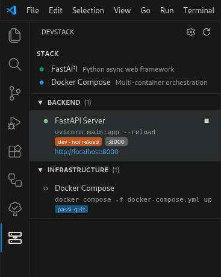

# DevStack

Auto-detect your project's tech stack and launch dev services from the VS Code activity bar.



## Features

- **Auto-detection** of Next.js, Nuxt, Remix, Astro, Vite, Angular, Go, FastAPI, Django, Flask, Rust, Docker Compose, Makefile, and npm scripts
- **Activity bar panel** with services grouped by role: Frontend, Backend, Database, Infrastructure, Full Stack
- **Inline play/stop buttons** on each service
- **Status indicators**: running (green check) / stopped (empty circle)
- **Managed terminals** — each service runs in a labelled VS Code terminal
- **Config override** via `.devstack.json` at workspace root

## Usage

Open a project. Click the DevStack icon in the activity bar. Click play on any detected service.

### Custom services (optional)

DevStack auto-detects most things, but anything that's specific to your workflow — a one-off script, a project-local task, a meta-command like "rebuild this extension" — belongs in a `.devstack.json` at the workspace root (or use the gear icon in the DevStack panel to create one).

This very repo dogfoods its own config. The [.devstack.json](.devstack.json) checked in here defines a single "Reload Extension" service that repackages the `.vsix` and reinstalls it, so iterating on DevStack is one click in DevStack itself:

```json
{
  "services": [
    {
      "name": "Reload Extension",
      "role": "infra",
      "command": "rm -f devstack-*.vsix && npx @vscode/vsce package --allow-missing-repository && code --install-extension devstack-*.vsix --force"
    }
  ],
  "disable": []
}
```

Each entry under `services` accepts `name`, `role`, `command`, and an optional `cwd` (relative to the workspace root). Valid roles: `frontend`, `backend`, `database`, `infra`, `fullstack`, `other`. Use `disable` to hide auto-detected services by name.

## Build from source

```bash
npm install
npx tsc -p ./
npx @vscode/vsce package --allow-missing-repository
code --install-extension devstack-0.2.1.vsix
```

## License

MIT
